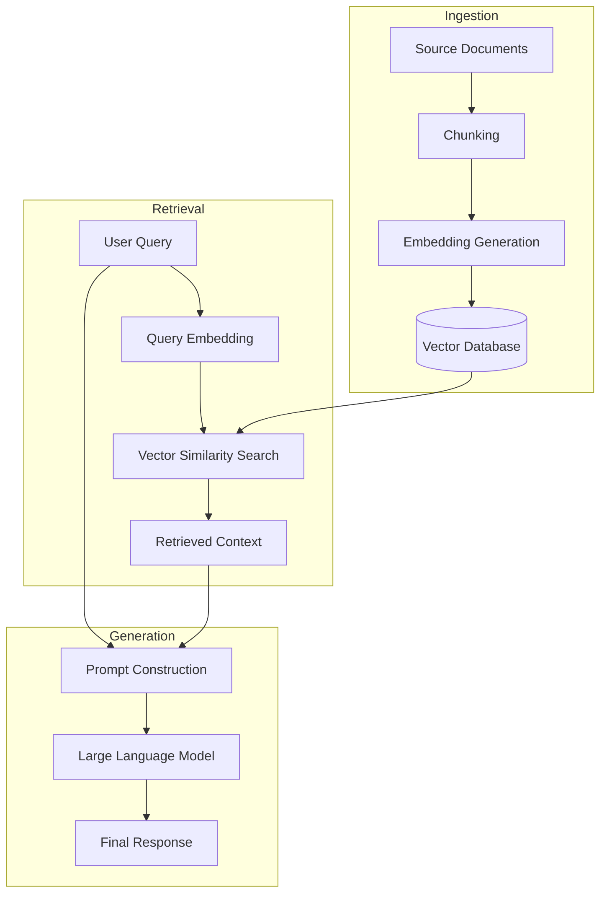
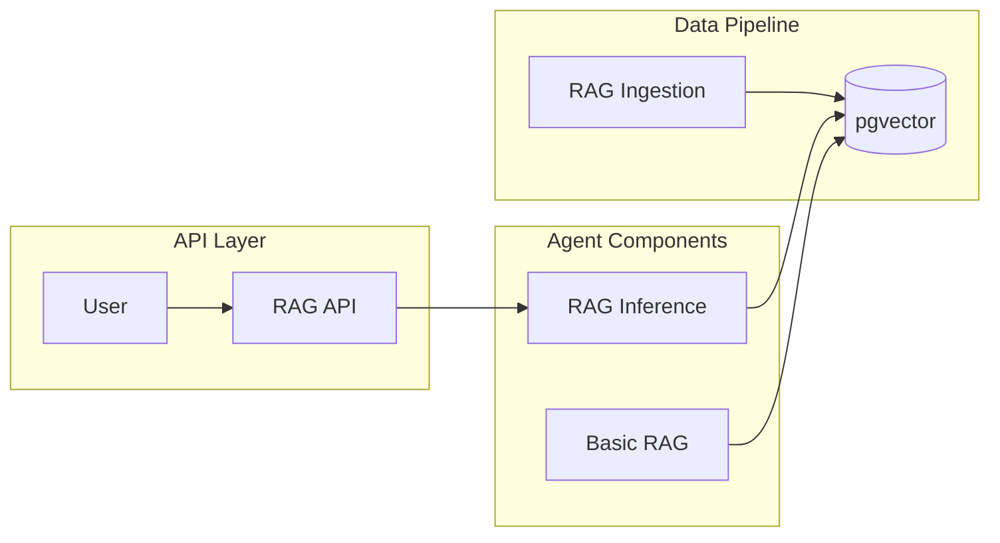

# Leveraging LLMs and Agentic Solutions: A Comprehensive Guide with PydanticAI

## Abstract

This article provides a comprehensive examination of how organizations and developers can effectively leverage Large Language Models (LLMs) and agentic solutions in their applications. Using PydanticAI as our implementation framework, we explore Retrieval Augmented Generation (RAG) as a practical pattern for developing robust, knowledge-grounded AI systems. The guide walks through conceptual foundations, architectural patterns, and practical implementation steps with annotated code examples. We conclude with emerging best practices and future directions for agentic AI systems.

## 1. Introduction: The Evolution of LLM Applications

Large Language Models have evolved from simple text completion tools to sophisticated reasoning systems that can execute multi-step tasks. This evolution has been marked by several key developments:

### 1.1 From Foundation Models to Agentic Systems

Foundation models like GPT-4 and Claude provide powerful general-purpose capabilities, but their true potential emerges when integrated into systems that can take actions based on their reasoning. Agentic AI represents the next frontier in this evolution — systems that can autonomously break down complex problems, gather relevant data, and interact with other tools and systems to execute solutions[^1].

### 1.2 Core Concepts: Agents, Tools, and Context

To understand agentic LLM solutions, we must first grasp their foundational components:

- **Agents**: Software entities that use LLMs for reasoning and decision-making
- **Tools**: Functions that agents can call to gather information or take actions
- **Context**: The information available to the agent for making decisions

These components work together to create systems that can reason, plan, and act in complex environments. However, developing production-ready AI systems often presents challenges like type safety, dependency management, and error handling[^2].

### 1.3 The Need for Structure and Discipline

As LLM applications move from prototypes to production, there's an increasing need for:

- Type safety and validation
- Dependency management
- Systematic testing and evaluation
- Efficient integration with existing systems

PydanticAI aims to address these needs through a structured, type-safe framework for building LLM-powered applications.

## 2. Understanding Retrieval Augmented Generation (RAG)

Retrieval Augmented Generation (RAG) has emerged as a powerful pattern for enhancing LLM capabilities by integrating external knowledge.

### 2.1 What is RAG and Why It Matters

RAG is an architecture that enhances LLMs by integrating external knowledge sources through a multi-step process:

1. **Retrieval**: Find relevant information from a knowledge base based on the query
2. **Augmentation**: Add this information to the prompt as context
3. **Generation**: Have the LLM generate a response using both the original query and retrieved context

This approach offers several key benefits:

- **Reduced hallucinations**: By grounding responses in retrieved facts
- **Up-to-date information**: Accessing external knowledge without retraining
- **Citability**: Tracing responses back to source documents
- **Cost efficiency**: Using smaller models with relevant context[^7]

### 2.2 Key Components of RAG Systems

A typical RAG implementation includes several critical components:



Each component plays a specific role:

- **Document processing**: Preparing, chunking, and cleaning documents
- **Embedding generation**: Converting text to vector representations
- **Vector databases**: Storing and efficiently searching embeddings
- **Vector similarity search**: Finding relevant documents for a query
- **Prompt construction**: Combining query and context effectively
- **Response generation**: Using the LLM to produce a final answer

### 2.3 The Evolution of RAG Techniques

RAG implementations have evolved from simple single-query approaches to more sophisticated methods:

- **Basic RAG**: Single query, single retrieval, direct generation
- **Advanced RAG**: Query decomposition, multi-step retrieval, reranking
- **Recursive RAG**: Using the LLM to refine search queries iteratively
- **Agent-based RAG**: Agents that decide when and what to retrieve

The implementation we'll explore uses PydanticAI to create an agent-based RAG system that can intelligently retrieve and use relevant information.

## 3. PydanticAI: A Type-Safe Agent Framework

PydanticAI is a recently developed framework designed to simplify the creation of production-grade AI agents.

### 3.1 Overview and Philosophy

PydanticAI builds upon Pydantic, a popular data validation library with over 285 million monthly downloads[^3]. It extends Pydantic's type validation capabilities to the LLM agent domain, providing a robust framework for building type-safe, maintainable AI applications[^9].

The core philosophy of PydanticAI centers around:

- **Type safety**: Ensuring data validation at runtime
- **Dependency injection**: Managing components and their dependencies
- **Structured agents**: Clear separation of concerns in agent design
- **Production readiness**: Focused on real-world applications

### 3.2 Core Components

PydanticAI's architecture revolves around several key components:

#### 3.2.1 Agent

Agents are PydanticAI's primary interface for interacting with LLMs[^10]. An agent serves as a container for:

- System prompts: Instructions for the LLM
- Function tools: Functions the LLM can call
- Structured result types: The expected return format
- Dependency type constraints: Types for dependency injection
- LLM model specifications: Which model to use and how

Here's a simple example of an agent definition from the RAG example code:

```python
agent = Agent(
    'openai:gpt-4o',
    deps_type=Deps,
    instrument=True
)
```

#### 3.2.2 RunContext

The RunContext object provides access to dependencies and state during agent execution:

```python
@agent.tool
async def retrieve(context: RunContext[Deps], search_query: str) -> str:
    # Access dependencies through context.deps
    embedding = await context.deps.openai.embeddings.create(
        input=search_query,
        model='text-embedding-3-small',
    )
    # ... rest of the implementation
```

#### 3.2.3 Tools

Tools are functions that agents can call to interact with the world. In PydanticAI, tools are registered with the agent using decorators:

```python
@agent.tool
async def retrieve(context: RunContext[Deps], search_query: str) -> str:
    """Retrieve documentation sections based on a search query."""
    # Implementation details
```

### 3.3 Dependency Injection Pattern

PydanticAI uses dependency injection to provide services to agents and tools. This pattern offers several benefits:

- **Testability**: Easy to mock dependencies for testing
- **Flexibility**: Swap implementations without changing code
- **Separation of concerns**: Clear boundaries between components

The pattern is implemented through the `deps_type` parameter in the Agent constructor and the `RunContext` generic type:

```python
@dataclass
class Deps:
    openai: AsyncOpenAI
    pool: asyncpg.Pool

agent = Agent('openai:gpt-4o', deps_type=Deps, instrument=True)

# Later, when running the agent:
deps = Deps(openai=openai, pool=pool)
answer = await agent.run(question, deps=deps)
```

### 3.4 Type Safety Benefits

By leveraging Pydantic's type validation, PydanticAI ensures that:

- Dependencies have the expected types
- Tool inputs and outputs are validated
- Agent results conform to the specified structure

This type safety reduces runtime errors and makes the system more robust and maintainable.

## 4. RAG Implementation with PydanticAI: A Walkthrough

Let's now examine a complete RAG implementation using PydanticAI, based on the provided example code.

### 4.1 System Architecture

The implementation consists of several components working together:



These components are organized into several Python files:

- `rag_ingestion.py`: Builds the vector database
- `rag_inference.py`: Core inference component for answering questions
- `rag.py`: Complete RAG example with search functionality
- `rag_api.py`: FastAPI web interface for the RAG system

### 4.2 Vector Database Setup

The implementation uses PostgreSQL with the pgvector extension for vector storage and similarity search:

```python
DB_SCHEMA = """
CREATE EXTENSION IF NOT EXISTS vector;

CREATE TABLE IF NOT EXISTS doc_sections (
    id serial PRIMARY KEY,
    url text NOT NULL UNIQUE,
    title text NOT NULL,
    content text NOT NULL,
    -- text-embedding-3-small returns a vector of 1536 floats
    embedding vector(1536) NOT NULL
);
CREATE INDEX IF NOT EXISTS idx_doc_sections_embedding ON doc_sections USING hnsw (embedding vector_l2_ops);
"""
```

Key aspects of this setup:

- The `vector` extension enables vector operations in PostgreSQL
- Document sections are stored with their content and embeddings
- An HNSW (Hierarchical Navigable Small World) index accelerates similarity search
- The index uses L2 (Euclidean) distance for similarity calculations

### 4.3 Ingestion Process

The ingestion process, defined in `rag_ingestion.py`, follows these steps:

1. **Fetch documents**: Retrieve source documents (in this case, from a JSON file)
2. **Process documents**: Parse and prepare document sections
3. **Generate embeddings**: Create vector embeddings for each section using the OpenAI API
4. **Store in database**: Save sections and embeddings in the vector database

Let's examine the key function responsible for embedding generation and storage:

```python
async def insert_doc_section(
    sem: asyncio.Semaphore,
    openai: AsyncOpenAI,
    pool: asyncpg.Pool,
    section: DocsSection,
) -> None:
    async with sem:
        url = section.url()
        exists = await pool.fetchval('SELECT 1 FROM doc_sections WHERE url = $1', url)
        if exists:
            logfire.info('Skipping {url=}', url=url)
            return

        with logfire.span('create embedding for {url=}', url=url):
            embedding = await openai.embeddings.create(
                input=section.embedding_content(),
                model='text-embedding-3-small',
            )
        assert len(embedding.data) == 1, (
            f'Expected 1 embedding, got {len(embedding.data)}, doc section: {section}'
        )
        embedding = embedding.data[0].embedding
        embedding_json = pydantic_core.to_json(embedding).decode()
        await pool.execute(
            'INSERT INTO doc_sections (url, title, content, embedding) VALUES ($1, $2, $3, $4)',
            url,
            section.title,
            section.content,
            embedding_json,
        )
```

This function:
1. Checks if the document section already exists
2. Creates an embedding using the OpenAI API
3. Serializes the embedding to JSON
4. Stores the section and embedding in the database

The ingestion process uses asynchronous programming with semaphores to limit concurrency and avoid rate limiting.

### 4.4 Agent Implementation

The core agent implementation in `rag.py` and `rag_inference.py` defines:

1. **Dependencies**: The resources needed by the agent
2. **Agent configuration**: Setting up the PydanticAI agent
3. **Retrieval tool**: The function that searches the vector database
4. **Entry point**: How to run the agent with a question

Let's look at the essential components:

#### 4.4.1 Dependencies Definition

```python
@dataclass
class Deps:
    openai: AsyncOpenAI
    pool: asyncpg.Pool
```

This simple dataclass encapsulates the external dependencies required by the agent: the OpenAI client and the database connection pool.

#### 4.4.2 Agent Configuration

```python
agent = Agent('openai:gpt-4o', deps_type=Deps, instrument=True)
```

This configures an agent using:
- The GPT-4o model from OpenAI
- Dependencies of type `Deps`
- Instrumentation for tracing and monitoring

#### 4.4.3 Retrieval Tool

The key component of the RAG system is the retrieval tool, which performs the vector similarity search[^11]:

```python
@agent.tool
async def retrieve(context: RunContext[Deps], search_query: str) -> str:
    """Retrieve documentation sections based on a search query."""
    with logfire.span('create embedding for {search_query=}', search_query=search_query):
        embedding = await context.deps.openai.embeddings.create(
            input=search_query,
            model='text-embedding-3-small',
        )

    embedding_json = pydantic_core.to_json(embedding.data[0].embedding).decode()
    rows = await context.deps.pool.fetch(
        'SELECT url, title, content FROM doc_sections ORDER BY embedding <-> $1 LIMIT 8',
        embedding_json,
    )
    return '\n\n'.join(
        f'# {row["title"]}\nDocumentation URL:{row["url"]}\n\n{row["content"]}\n'
        for row in rows
    )
```

This tool:
1. Creates an embedding for the search query
2. Performs a vector similarity search using the `<->` operator
3. Formats the retrieved sections into a markdown string
4. Returns the formatted context to the agent

### 4.5 API Integration

The `rag_api.py` file demonstrates how to expose the RAG system through a FastAPI web interface:

```python
@app.get("/ask", response_model=Answer)
async def ask_question_get(question: str, deps: Deps = Depends(get_deps)):
    """Ask a question using a GET request with a query parameter."""
    logfire.info('API received question via GET: "{question}"', question=question)
    answer = await agent.run(question, deps=deps)
    return Answer(answer=answer.data)
```

This endpoint:
1. Receives a question through an HTTP GET request
2. Logs the question
3. Runs the agent with the question and dependencies
4. Returns the answer as a structured response

The API also includes a health check endpoint and supports both GET and POST requests for flexibility.

## 5. Best Practices and Design Patterns

Implementing effective LLM and agent-based systems requires careful attention to design and operational considerations.

### 5.1 Efficient Retrieval Strategies

Vector retrieval is at the heart of RAG systems, and several practices can improve its effectiveness[^12]:

#### 5.1.1 Chunking Strategies

Document chunking significantly impacts retrieval quality:

- **Semantic chunking**: Divide documents by semantic units (paragraphs, sections)
- **Overlapping chunks**: Allow for context at chunk boundaries
- **Metadata enrichment**: Attach hierarchical context to chunks

#### 5.1.2 Embedding Selection

The choice of embedding model affects both performance and cost:

- **Dimension tradeoffs**: Higher dimensions provide more precision but consume more storage
- **Specialized models**: Domain-specific embeddings for specialized content
- **Batching**: Process embeddings in batches for efficiency

#### 5.1.3 Advanced Retrieval Techniques

Beyond basic vector search:

- **Hybrid search**: Combine vector similarity with keyword matching
- **Reranking**: Use a secondary model to refine initial search results
- **Multi-stage retrieval**: Progressive filtering to improve precision

### 5.2 Agentic Design Patterns

The field of agentic AI has developed several useful design patterns[^4]:

#### 5.2.1 Reflection Pattern

Agents that can reflect on their own reasoning often make better decisions:

```python
@agent.tool
async def reflect(context: RunContext[Deps], reasoning: str) -> str:
    """Reflect on the reasoning process and identify potential errors."""
    # Implementation
```

#### 5.2.2 Tool Use Pattern

Effective agents know when and how to use tools:

```python
@agent.tool
async def search_documentation(context: RunContext[Deps], query: str) -> str:
    """Search the documentation for information relevant to the query."""
    # Implementation
```

#### 5.2.3 Planning Pattern

Breaking complex tasks into manageable steps improves success rates:

```python
@agent.tool
async def create_plan(context: RunContext[Deps], goal: str) -> list[str]:
    """Create a step-by-step plan to achieve the goal."""
    # Implementation
```

#### 5.2.4 Multi-Agent Collaboration

Complex problems benefit from specialized agents working together:

```python
# Define specialized agents
research_agent = Agent('openai:gpt-4o', deps_type=Deps)
coding_agent = Agent('openai:gpt-4o', deps_type=Deps)
review_agent = Agent('openai:gpt-4o', deps_type=Deps)

# Orchestrate their collaboration
async def solve_problem(question: str, deps: Deps):
    research_result = await research_agent.run(question, deps=deps)
    coding_result = await coding_agent.run(f"Implement a solution based on: {research_result.data}", deps=deps)
    review_result = await review_agent.run(f"Review this implementation: {coding_result.data}", deps=deps)
    return review_result.data
```

### 5.3 Evaluation and Testing

Effective evaluation is crucial for improving RAG and agent systems:

#### 5.3.1 RAG Evaluation Dimensions

Key aspects to evaluate[^5]:

- **Retrieval accuracy**: Precision, recall, and relevance of retrieved documents
- **Response quality**: Factual accuracy, completeness, coherence
- **Faithfulness**: Alignment between response and retrieved context
- **Efficiency**: Latency, resource usage, cost

#### 5.3.2 Testing Approaches

Comprehensive testing should include:

- **Unit tests**: Individual components (embeddings, retrieval, tools)
- **Integration tests**: End-to-end system behavior
- **Adversarial testing**: Edge cases and potential failure modes
- **Human evaluation**: Subjective quality assessment

### 5.4 Production Considerations

Moving systems to production introduces additional concerns:

#### 5.4.1 Performance Optimization

- **Caching**: Store common queries and embeddings
- **Batching**: Group operations for efficiency
- **Scaling**: Distribute across multiple servers

#### 5.4.2 Monitoring and Observability

- **Logging**: Capture input/output pairs
- **Metrics**: Track latency, token usage, retrieval quality
- **Alerts**: Notify on degraded performance

#### 5.4.3 Security and Privacy

- **Data handling**: Secure storage of sensitive information
- **User data**: Clear policies on data retention and use
- **Prompt injection**: Defenses against manipulation

## 6. Future Directions and Emerging Patterns

The field of agentic AI and LLM applications continues to evolve rapidly.

### 6.1 Autonomous Agent Architectures

The next generation of agents will feature[^6]:

- **Self-improvement**: Agents that refine their own capabilities
- **Meta-reasoning**: Decision-making about how to reason
- **Memory management**: Sophisticated storage and retrieval of past experiences

### 6.2 Advanced Orchestration

Complex workflows will require sophisticated coordination:

- **Hierarchical agents**: Managers that delegate to specialized workers
- **Market-based allocation**: Agents that bid for tasks based on capabilities
- **Emergent cooperation**: Agents that develop collaborative strategies

### 6.3 Tool Creation and Discovery

Future agents will extend beyond using predefined tools:

- **Code generation**: Creating custom tools on demand
- **API discovery**: Finding and learning to use new interfaces
- **Tool composition**: Combining existing tools in novel ways

### 6.4 Ethical Considerations

As agents become more autonomous, ethical concerns become paramount:

- **Alignment**: Ensuring agents pursue intended goals
- **Transparency**: Making agent reasoning explainable
- **Control**: Maintaining appropriate human oversight
- **Bias mitigation**: Addressing underlying biases in models and data

## Conclusion

Large Language Models and agentic solutions represent a significant step forward in AI capabilities. By combining the reasoning power of LLMs with structured frameworks like PydanticAI and patterns like RAG, developers can create systems that are both powerful and practical.

The implementation walkthrough provided in this article demonstrates how these concepts translate into real-world code. As the field continues to evolve, the foundational principles of type safety, modularity, and thoughtful design will remain essential for building robust and effective AI systems.

Organizations looking to leverage these technologies should start with well-defined use cases, invest in quality data and embeddings, and implement structured evaluation approaches. With careful attention to best practices and an awareness of emerging patterns, AI systems can deliver substantial value while maintaining reliability and trustworthiness.

## References

[^1]: Harvard Business Review, "What Is Agentic AI, and How Will It Change Work?", December 2024, Available: https://hbr.org/2024/12/what-is-agentic-ai-and-how-will-it-change-work

[^2]: NVIDIA Blogs, "What Is Retrieval-Augmented Generation aka RAG", April 2024, Available: https://blogs.nvidia.com/blog/what-is-retrieval-augmented-generation/

[^3]: Pydantic Documentation, "Welcome to Pydantic," Available: https://docs.pydantic.dev/latest/

[^4]: Analytics Vidhya, "Top 4 Agentic AI Design Patterns for Architecting AI Systems," October 2024, Available: https://www.analyticsvidhya.com/blog/2024/10/agentic-design-patterns/

[^5]: Evaluation of Retrieval-Augmented Generation: A Survey, arXiv:2405.07437v2, 2024, Available: https://arxiv.org/html/2405.07437v2

[^6]: Vellum, "Agentic Workflows in 2025: The ultimate guide," Available: https://www.vellum.ai/blog/agentic-workflows-emerging-architectures-and-design-patterns

[^7]: Lewis et al., "Retrieval-Augmented Generation for Knowledge-Intensive NLP Tasks," Advances in Neural Information Processing Systems, 2020, Available: https://dl.acm.org/doi/abs/10.5555/3495724.3496517

[^8]: GitHub, "pydantic/pydantic-ai: RAG example with pydantic-ai," Available: https://github.com/pydantic/pydantic-ai/blob/main/examples/pydantic_ai_examples/rag.py

[^9]: PydanticAI, "Agent Framework / shim to use Pydantic with LLMs," GitHub Repository (8.1k stars), Available: https://github.com/pydantic/pydantic-ai

[^10]: PydanticAI, "Agents - PydanticAI Official Documentation," Available: https://ai.pydantic.dev/agents/

[^11]: PydanticAI, "RAG search example - Official Documentation," Available: https://ai.pydantic.dev/examples/rag/

[^12]: AWS Database Blog, "Optimize generative AI applications with pgvector indexing: A deep dive into IVFFlat and HNSW techniques," Available: https://aws.amazon.com/blogs/database/optimize-generative-ai-applications-with-pgvector-indexing-a-deep-dive-into-ivfflat-and-hnsw-techniques/