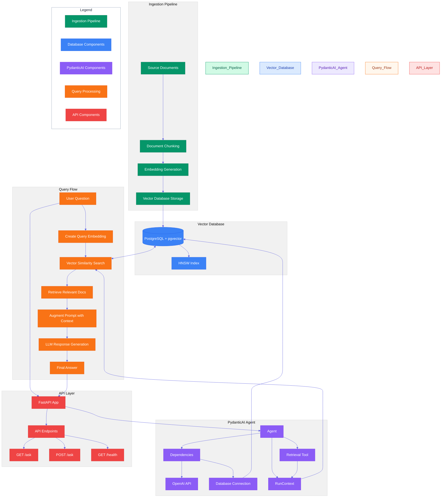

```mermaid
%%{init: {'theme': 'base', 'themeVariables': {
  'primaryColor': '#6366f1',
  'primaryTextColor': '#fff',
  'primaryBorderColor': '#5d5fde',
  'lineColor': '#5d5fde',
  'secondaryColor': '#f1f1f1',
  'tertiaryColor': '#f1f1f1'
}}}%%

flowchart TB
    %% Data Pipeline - Green colors
    subgraph "Ingestion Pipeline" [Ingestion Pipeline]
        direction TB
        style Ingestion_Pipeline fill:#d1fae5,stroke:#059669,color:#065f46
        docs[Source Documents]:::greenNode --> chunking[Document Chunking]:::greenNode
        chunking --> embedding[Embedding Generation]:::greenNode
        embedding --> storage[Vector Database Storage]:::greenNode
    end

    %% Vector Database - Blue colors
    subgraph "Vector Database" [Vector Database]
        style Vector_Database fill:#dbeafe,stroke:#3b82f6,color:#1e40af
        storage --> pgvector[(PostgreSQL + pgvector)]:::blueNode
        pgvector --> index[HNSW Index]:::blueNode
    end

    %% PydanticAI Agent - Purple colors
    subgraph "PydanticAI Agent" [PydanticAI Agent]
        direction TB
        style PydanticAI_Agent fill:#ede9fe,stroke:#8b5cf6,color:#5b21b6
        agent[Agent]:::purpleNode --> deps[Dependencies]:::purpleNode
        agent --> tools[Retrieval Tool]:::purpleNode
        deps --> openai[OpenAI API]:::purpleNode
        deps --> db_conn[Database Connection]:::purpleNode
        agent --> runContext[RunContext]:::purpleNode
    end

    %% Query Flow - Orange colors
    subgraph "Query Flow" [Query Flow]
        direction LR
        style Query_Flow fill:#fff7ed,stroke:#f97316,color:#9a3412
        userQ[User Question]:::orangeNode --> query_embedding[Create Query Embedding]:::orangeNode
        query_embedding --> vector_search[Vector Similarity Search]:::orangeNode
        vector_search --> docs_retrieval[Retrieve Relevant Docs]:::orangeNode
        docs_retrieval --> prompt_augmentation[Augment Prompt with Context]:::orangeNode
        prompt_augmentation --> llm_generation[LLM Response Generation]:::orangeNode
        llm_generation --> answer[Final Answer]:::orangeNode
    end

    %% API Layer - Red colors
    subgraph "API Layer" [API Layer]
        direction TB
        style API_Layer fill:#fee2e2,stroke:#ef4444,color:#b91c1c
        fastapi[FastAPI App]:::redNode --> endpoints[API Endpoints]:::redNode
        endpoints --> get_endpoint[GET /ask]:::redNode
        endpoints --> post_endpoint[POST /ask]:::redNode
        endpoints --> health_endpoint[GET /health]:::redNode
    end

    %% Component connections
    pgvector <--> vector_search
    tools --> runContext
    runContext --> vector_search
    db_conn --> pgvector
    fastapi --> agent
    userQ --> fastapi
    answer --> fastapi

    %% Node styles
    classDef greenNode fill:#059669,stroke:#047857,color:white
    classDef blueNode fill:#3b82f6,stroke:#2563eb,color:white
    classDef purpleNode fill:#8b5cf6,stroke:#7c3aed,color:white
    classDef orangeNode fill:#f97316,stroke:#ea580c,color:white
    classDef redNode fill:#ef4444,stroke:#dc2626,color:white

    %% Legend
    subgraph Legend [Legend]
        style Legend fill:white,stroke:#94a3b8,color:#1e293b
        ingestionLegend[Ingestion Pipeline]:::greenNode
        dbLegend[Database Components]:::blueNode
        agentLegend[PydanticAI Components]:::purpleNode 
        queryLegend[Query Processing]:::orangeNode
        apiLegend[API Components]:::redNode
    end
```